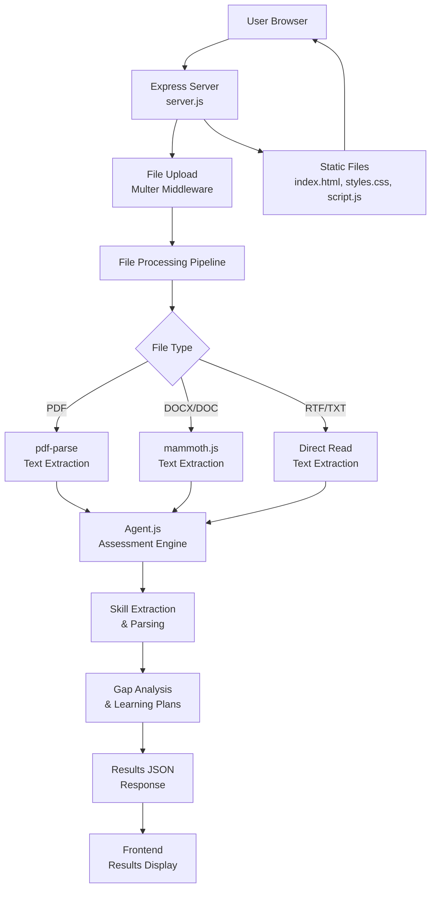

## Project Architecture



### Architecture Overview
The application follows a client-server architecture with clear separation of concerns:

1. **Frontend Layer**: Provides the user interface for file uploads, displays results, and handles user interactions
2. **Backend Layer**: Express.js server handles HTTP requests, file processing, and API endpoints
3. **Processing Layer**: Specialized libraries handle different document formats and extract text content
4. **Assessment Layer**: Core business logic analyzes skills, identifies gaps, and generates learning recommendations

### File Processing Pipeline
```
User Upload → Client Validation → Server Reception → Format Detection → Text Extraction → Skill Parsing → Assessment Results → Frontend Display → Automatic Cleanup
```

## Logic & Scoring Description

### Skill Extraction Algorithm
The system employs intelligent text processing to extract skills from documents:

1. **Document Parsing**: Uses format-specific libraries to convert files to plain text
2. **Skill Identification**: Searches for predefined skill keywords and technical terms
3. **Context Analysis**: Considers surrounding text to validate skill mentions
4. **Deduplication**: Removes duplicate skills and normalizes naming conventions

### Proficiency Assessment
- **Scale**: 1-5 rating system (1 = Beginner, 5 = Expert)
- **Self-Assessment**: Users rate their actual proficiency levels
- **Gap Calculation**: Compares required skills against candidate skills and self-ratings
- **Threshold Logic**: Skills rated below 3/5 are flagged as gaps

### Learning Plan Generation
- **Adjacent Skills**: Recommends related skills that complement identified gaps
- **Resource Curation**: Provides quality learning materials with time estimates
- **Personalization**: Adapts recommendations based on skill categories and proficiency levels
- **Prioritization**: Orders recommendations by job requirement importance
