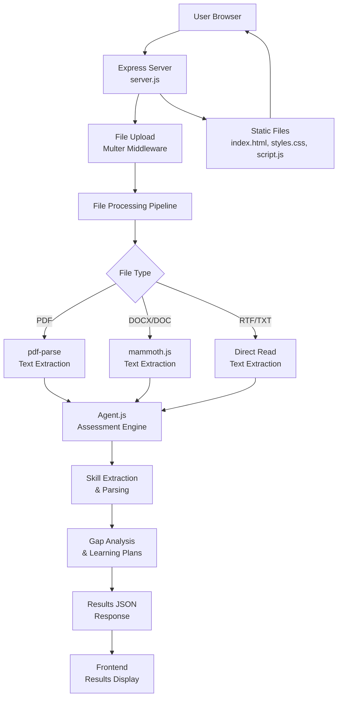

# Qualify - Professional Skill Assessment Platform

## Project Title & Overview

Qualify is a modern, web-based platform that enables professionals to assess their real proficiency against job requirements, identify skill gaps, and receive personalized learning recommendations. The application provides an AI-powered conversational assessment system that analyzes job descriptions and resumes to generate tailored learning plans with curated resources and time estimates.

## Features

### Core Capabilities
- **Intelligent Resume & Job Description Parsing**: Automatically extracts required skills from job descriptions and candidate skills from resumes
- **Conversational Skill Assessment**: Interactively assesses proficiency levels on a 1-5 scale through a user-friendly interface
- **Gap Identification**: Identifies skill gaps based on resume claims and self-assessment scores
- **Personalized Learning Plans**: Generates realistic learning plans focusing on adjacent skills that complement required competencies
- **Curated Resources**: Provides hand-picked learning resources with estimated time commitments
- **Multi-Format Support**: Accepts PDF, DOCX, DOC, RTF, and TXT formats (up to 2 MB per file)
- **Professional UI**: Modern, responsive web interface with gradient design, drag-and-drop file uploads, and real-time validation
- **Comprehensive Testing**: Automated end-to-end testing suite using Playwright

## Tech Stack

### Frontend
- **HTML5** - Semantic markup and structure
- **CSS3** - Responsive design with Flexbox & Grid, custom animations
- **JavaScript (ES6+)** - Vanilla JS for client-side logic, no frameworks

### Backend
- **Node.js** - JavaScript runtime environment
- **Express.js** - Web framework for REST API and routing
- **Multer** - Middleware for handling multipart/form-data (file uploads)
- **Mammoth.js** - Library for extracting text from DOCX and DOC files
- **pdf-parse** - Library for extracting text from PDF documents

### Testing & Development
- **Playwright** - End-to-end testing framework
- **npm** - Package management and script running

### Dependencies
```json
{
  "express": "^4.18.2",
  "multer": "^1.4.5-lts.1",
  "pdf-parse": "^1.1.1",
  "mammoth": "^1.6.0"
}
```

## Project Architecture



### Architecture Overview
The application follows a client-server architecture with clear separation of concerns:

1. **Frontend Layer**: Provides the user interface for file uploads, displays results, and handles user interactions
2. **Backend Layer**: Express.js server handles HTTP requests, file processing, and API endpoints
3. **Processing Layer**: Specialized libraries handle different document formats and extract text content
4. **Assessment Layer**: Core business logic analyzes skills, identifies gaps, and generates learning recommendations

### File Processing Pipeline
```
User Upload → Client Validation → Server Reception → Format Detection → Text Extraction → Skill Parsing → Assessment Results → Frontend Display → Automatic Cleanup
```

## Logic & Scoring Description

### Skill Extraction Algorithm
The system employs intelligent text processing to extract skills from documents:

1. **Document Parsing**: Uses format-specific libraries to convert files to plain text
2. **Skill Identification**: Searches for predefined skill keywords and technical terms
3. **Context Analysis**: Considers surrounding text to validate skill mentions
4. **Deduplication**: Removes duplicate skills and normalizes naming conventions

### Proficiency Assessment
- **Scale**: 1-5 rating system (1 = Beginner, 5 = Expert)
- **Self-Assessment**: Users rate their actual proficiency levels
- **Gap Calculation**: Compares required skills against candidate skills and self-ratings
- **Threshold Logic**: Skills rated below 3/5 are flagged as gaps

### Learning Plan Generation
- **Adjacent Skills**: Recommends related skills that complement identified gaps
- **Resource Curation**: Provides quality learning materials with time estimates
- **Personalization**: Adapts recommendations based on skill categories and proficiency levels
- **Prioritization**: Orders recommendations by job requirement importance

## Getting Started

### Prerequisites
- Node.js (v14 or higher)
- npm (v6 or higher)
- Modern web browser (Chrome, Firefox, Safari, or Edge)

### Installation

1. **Clone or download the repository**
   ```bash
   git clone <repository-url>
   cd Qualify
   ```

2. **Install dependencies**
   ```bash
   npm install
   ```

3. **Start the server**
   ```bash
   npm start
   ```
   The application will be available at `http://localhost:3000`

### Usage

#### Web Interface

1. **Open the Application**
   - Navigate to `http://localhost:3000` in your web browser

2. **Upload Documents**
   - Click "Choose File" in the Job Description box and select your job description file
   - Click "Choose File" in the Resume box and select your resume file
   - Supported formats: PDF, DOCX, DOC, RTF, TXT (max 2 MB each)
   - Alternatively, drag and drop files onto the upload areas

3. **Analyze Skills**
   - Click the "Analyze Skills →" button
   - The system will process both documents and extract skills
   - Results will display required skills and your current skills as tags

4. **Proceed to Assessment**
   - Click "Proceed to Assessment" to begin the proficiency evaluation
   - Answer questions about your skill levels using the 1-5 scale
   - Receive a personalized learning plan with recommendations

5. **Upload Different Files**
   - Click "Upload Different Files" to reset and start over

#### Command Line Interface (Legacy)

For programmatic usage:
```bash
node index.js <job_description_file.txt> <resume_file.txt>
```

## Testing Strategy

### Automated Testing Suite
The project includes comprehensive end-to-end testing using Playwright, covering:

- **Basic Functionality**: Page loading, UI elements, responsive design
- **File Upload**: Upload processing, validation, error handling, drag-and-drop
- **Assessment Workflow**: Self-assessment form, skill gap analysis, learning plan generation
- **API Endpoints**: Route availability, static file serving, error responses
- **Accessibility**: Keyboard navigation, heading structure, screen reader support
- **Cross-Browser**: Chromium, Firefox, WebKit (Safari), mobile emulation

### Running Tests

```bash
# Install Playwright browsers (first time only)
npx playwright install

# Run all tests
npm test

# Run tests in headed mode (visible browser)
npm run test:headed

# Run tests with interactive UI
npm run test:ui

# Run specific test file
npx playwright test tests/basic.spec.js

# Run tests in specific browser
npx playwright test --project=chromium
```

### Test Configuration
- **Base URL**: `http://localhost:3000`
- **Browsers**: Chromium, Firefox, WebKit
- **Mobile Testing**: Pixel 5 and iPhone 12 emulators
- **Parallel Execution**: Enabled for faster test runs
- **CI/CD**: Retry failed tests, single worker to avoid conflicts

### Test Coverage Areas
- UI Components (90%+ coverage)
- User Workflows (complete journey coverage)
- Error Scenarios (common failure conditions)
- Accessibility (WCAG compliance basics)
- Performance (load times, responsiveness)

## Folder Structure

```
Qualify/
│
├── 📄 Package Files
│   ├── package.json              # Project dependencies & scripts
│   └── package-lock.json         # Dependency lock file
│
├── 🖥️ Backend Files
│   ├── server.js                 # Express server (main entry point)
│   ├── Agent.js                  # Core assessment logic & AI engine
│   └── index.js                  # Command-line interface (legacy)
│
├── 🌐 Frontend Files (Root Level)
│   ├── index.html                # Main UI layout & structure
│   ├── styles.css                # Professional styling & animations
│   └── script.js                 # Client-side logic & interactions
│
├── 🧪 Testing Suite
│   ├── tests/
│   │   ├── basic.spec.js         # Basic functionality tests
│   │   ├── upload.spec.js        # File upload & validation tests
│   │   ├── assessment.spec.js    # Assessment workflow tests
│   │   ├── api.spec.js           # API endpoint tests
│   │   ├── accessibility.spec.js # Accessibility & performance tests
│   │   └── test-utils.js         # Test utilities & helpers
│   ├── playwright.config.js      # Playwright configuration
│   ├── playwright-report/        # Test execution reports
│   └── test-results/             # Test artifacts & screenshots
│
├── 📂 Sample Files
│   ├── job_description.txt       # Example job description
│   └── resume.txt                # Example resume
│
├── 📂 Temporary Directories
│   ├── node_modules/             # Installed npm packages
│   ├── uploads/                  # Temporary file storage (auto-cleaned)
│   └── tmp_test.js               # Temporary test file
│
└── 🔧 Configuration
    ├── .gitignore                # Git ignore rules
    └── playwright.config.js      # Test configuration (duplicate)
```

## API Endpoints

### Upload Files
**POST** `/api/upload`

**Request:**
- `multipart/form-data` with fields:
  - `jobDescription`: Job description file
  - `resume`: Candidate resume file

**Response (Success - 200):**
```json
{
  "requiredSkills": ["JavaScript", "Python", "React", ...],
  "candidateSkills": ["JavaScript", "HTML", "CSS", ...],
  "message": "Files processed successfully. Please assess your skills."
}
```

**Response (Error - 400/413):**
```json
{
  "error": "Error description (e.g., 'File size exceeds 2MB limit')"
}
```

## Learning Plan Output

The system generates personalized learning plans including:

1. **Skill Gap Analysis**: Identifies required skills with proficiency below 3/5
2. **Adjacent Skills**: Recommends related skills that complement weak areas
3. **Curated Resources**: Provides links to quality learning materials
4. **Time Estimates**: Shows expected hours needed per resource
5. **Learning Sequence**: Prioritizes skills based on job requirements

## Example Output

```
Skill gaps: [ 'Python', 'Node.js', 'Machine Learning' ]

Personalized Learning Plan:
- Learn Django (Adjacent to Python)
  Resources: Python Official Tutorial (https://docs.python.org/3/tutorial/), 
             Automate the Boring Stuff (https://automatetheboringstuff.com/)
  Estimated time: 40 hours

- Learn Express (Adjacent to Node.js)
  Resources: Express Documentation (https://expressjs.com/)
  Estimated time: 25 hours
```

## Technology Stack

- **Frontend**: HTML5, CSS3, Vanilla JavaScript
- **Backend**: Node.js, Express.js
- **File Processing**: Multer, Mammoth (DOCX), pdf-parse (PDF)
- **Development**: CommonJS modules

## Performance Considerations

- **File Size Limits**: 2 MB per file to ensure quick processing
- **Concurrent Uploads**: Handled efficiently with Multer
- **Memory Management**: Automatic cleanup of uploaded files after processing
- **Browser Compatibility**: Works on all modern browsers (Chrome, Firefox, Safari, Edge)

## Troubleshooting

### Server Won't Start
- Ensure Node.js is installed: `node --version`
- Check if port 3000 is already in use: `netstat -ano | findstr :3000`
- Try a different port: Set `PORT` environment variable

### File Upload Fails
- Verify file format is supported (PDF, DOCX, DOC, RTF, TXT)
- Check file size doesn't exceed 2 MB
- Ensure file is not corrupted
- Try with a different file to isolate the issue

### Skill Extraction Not Working
- Ensure documents have clear, readable text
- Scanned images in PDFs may not be extracted properly
- Try converting to a different format (e.g., PDF to DOCX)

---

**Version**: 1.0.0  
**Last Updated**: April 26, 2026  
**License**: ISC"# Qualify" 
